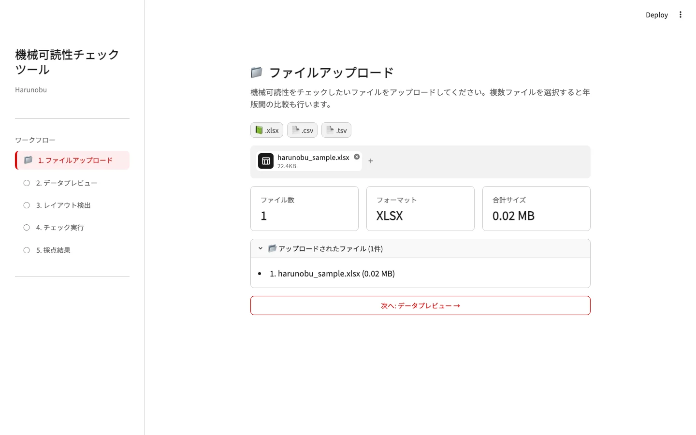
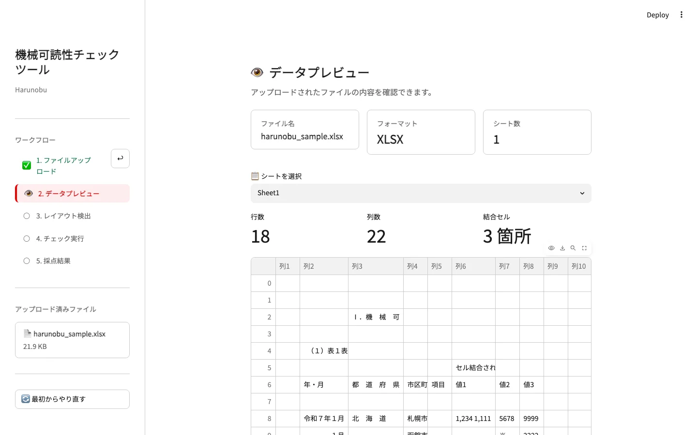
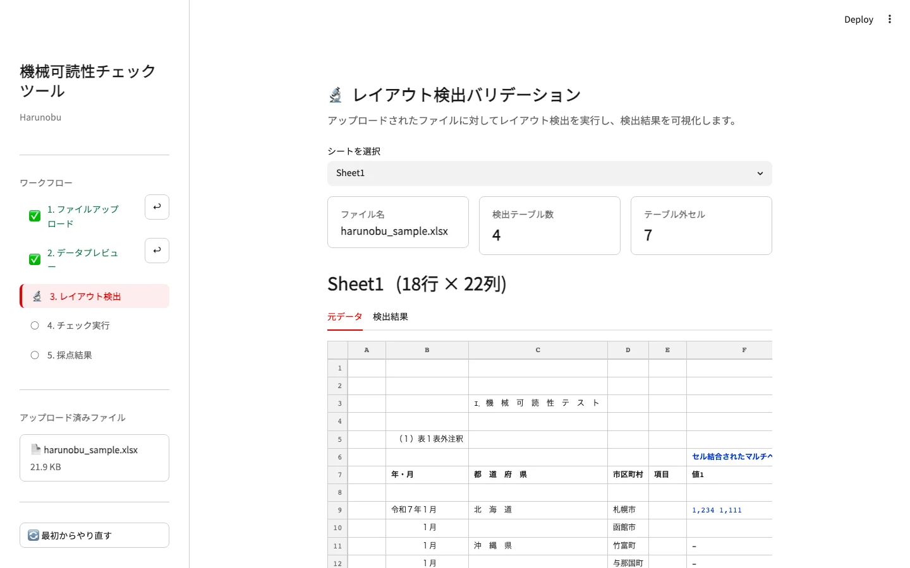
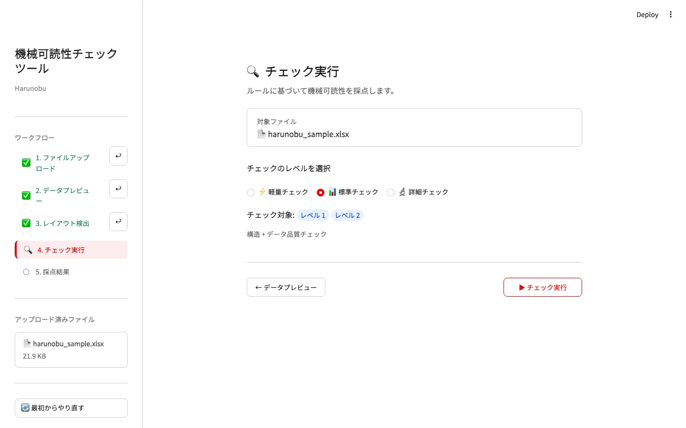
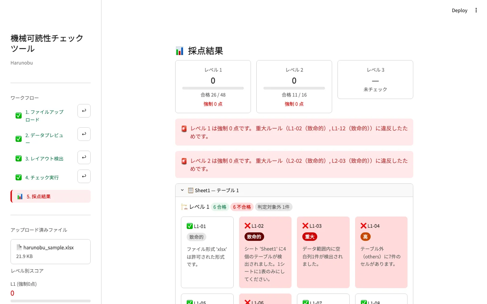

# Streamlit UI 利用マニュアル

Harunobu の Streamlit UI では、Excel/CSV/TSV ファイルをアップロードし、プレビュー、レイアウト検出、採点、結果確認までをブラウザ上で実行できます。
このページでは `samples/harunobu_sample.xlsx` を使った基本操作を説明します。

## 起動方法

ローカル環境では `sample_app/` ディレクトリから Streamlit を起動します。

```bash
cd sample_app
uv run streamlit run app.py
```

起動後、ブラウザで `http://localhost:8501` を開きます。

## 操作フロー

Streamlit UI の基本フローは次の通りです。

```text
UPLOAD → PREVIEW → VALIDATION → SCORING → RESULT
```

### 1. UPLOAD

最初に、判定対象のファイルをアップロードします。単一ファイルの場合は、アップロード後にデータプレビューへ進みます。



### 2. PREVIEW

アップロードしたファイルのシート、行数、列数、セル内容を確認します。内容を確認したら、レイアウト検出へ進みます。



### 3. VALIDATION

レイアウト検出では、元データと検出結果を確認できます。検出されたテーブル数、テーブル外セル、テーブル構造を確認してからチェック実行へ進みます。



### 4. SCORING

チェック実行画面では、採点モードを選択します。通常利用では既定の標準チェックを使います。



### 5. RESULT

採点結果画面では、レベル別スコア、違反箇所、シート別の違反セル表示を確認できます。結果は JSON または CSV でダウンロードできます。



